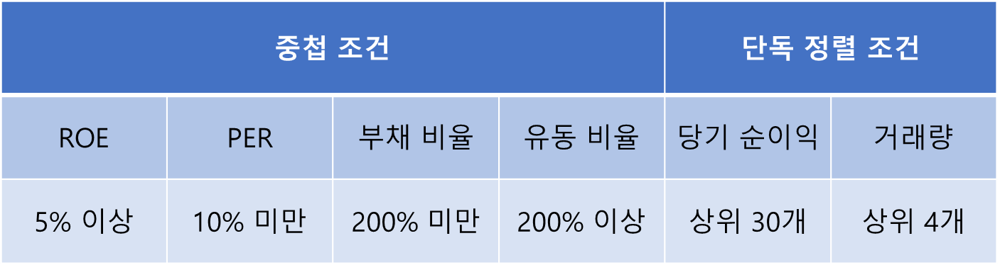

# 2018년 데이터 분석에 기반한 주식 매매

> 프로젝트 설명
> 
- 2018년 과거 데이터에 기반하여 투자 종목을 선정하고 지표를 분석
- 분석한 지표에 맞게 매매 전략을 수립하고 수익률 확인

## 1. 종목 선정

- 종목 선정 기준

---

## 2. 투자 방법

- 유명한 변동 보조 지표를 활용
  
    
    
    - 볼린저 밴드
    
    
    
    - RSI
    
    
    
    - MACD

---

## 3. 결론

