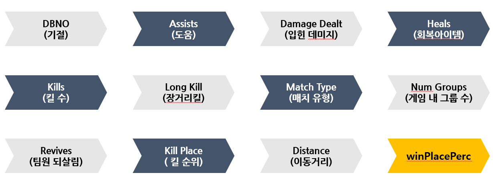

# [Kaggle] PUBG 순위 예측

> 프로젝트 설명
> 
- PUBG에서의 최종 순위를 예측
- 익명의 유저 65000게임이상의 데이터를 받고 , 훈련과 테스트셋을 제공받아 최종 배치를 예측하는 대회

---

## 1. 주요 컬럼



---

---

## 2. 데이터 전처리

- 특수한 상황하거나 일어날수 없는 경우를 이상치라 판단하고 삭제함

### 2.1 이상치 목록

- 입힌 데미지가 0인데 유효한 킬이나 기절이 발생한 경우
- 1등이 존재하지 않는 매치
- 실질적 플레이어(numgroup)가 1명인 매치
- 듀오, 스쿼드 등 그룹 인원수가 일치하지 않는 경우
- 매치 킬 수가 이상한 경우
- 매치 내 인원수 < 킬 수 더 많은 경우
- 운전한 거리에 비해 로드킬 수가 과하게 많음
- 무기 사용이 0인데 1등을 한 플레이어
- 솔로큐인데 어떻게 팀원을 살린 경우

---

## 3. 예측 향상에 필요한 컬럼 추가

- 종속 변수 WinPlacePerc와 상관 계수가 높은 컬럼들을 조합/변형하여 컬럼 추가


---

## 4. 알고리즘

### 4.1 데이터셋의 다양한 케이스화


### 4.2 GridSearchCV를 이용한 하이퍼파라미터 찾기

```jsx
params = {
    'booster' :['gbtree'],
    "n_estimators":[100,200], # 트리 개수 100개
    "max_depth":[6, 8, 10, 12], # 최대 트리의 깊이 6, 8,10 ,12
    'min_child_weight':[1,3,5], # 최소 트리잎의 개수
    'colsample_bytree':[0.5,0.8], # 전체 데이터 로우 중에서 
    'colsample_bylevel':[0.9],      # 최소 몇개의 데이터를 이용해서 트리를 만들거냐
}

model = xgb.XGBRegressor(n_jobs = 10)

cv = KFold(n_splits=6)

gcv = GridSearchCV(model,param_grid=params,cv=cv, n_jobs=10)

gcv.fit(X_train,y_train)

print('final params', gcv.best_params_)   # 최적의 파라미터 값 출력
print('best score', gcv.best_score_)      # 최고의 점수
```

### 4.3 5개의 알고리즘 적용

```jsx
df = pd.DataFrame(columns = ['data','mse' , 'mae', 'r2','rmse'])

str1 = ["컬럼V1" ,"컬럼V2"]
str2 = ["_상관 계수","_상관+다중"] 
score = ['mse' , 'mae', 'r2','rmse']
model_name = ["_xgb",'_lgbm','_gbr','_et','_rf']

cnt = 0
num = 0

for i in model_list:
  for j in range(len(X_train_list)):
    
    # i번쨰 모델 학습
    i.fit(X_train_list[j],y_train_list[j])

    # i번쨰 모델 예측
    pred = i.predict(X_test_list[j])

    # 성능 측정
    mse = mean_squared_error(pred, y_test_list[j])
    mae = mean_absolute_error(pred, y_test_list[j])
    r2 = r2_score(pred, y_test_list[j])
    rmse = np.sqrt(mean_squared_error(pred, y_test_list[j]))

    # train1, train2는 컬럼만 추가한 데이터 셋
    if j < 2: 
      df.loc[num + j] = [str1[j] + model_name[cnt], mse , mae, r2, rmse]

    # train3, train4는 컬럼추가 후 상관계수의 절댓값이 0.1보다 작은것을 제거한 데이터 셋
    # 따라서  str2(_상관 계수) 문자열을 추가해 줌
    elif j< 4:
      df.loc[num + j] = [str1[(j%2)] + str2[0] + model_name[cnt], mse , mae, r2, rmse]
    else:
      df.loc[num + j] = [str1[(j%2)] + str2[1] + model_name[cnt], mse , mae, r2, rmse]
  
  # 데이터프레임 덮어쓰기 방지
  cnt += 1
  num += 6
  print(df)
```


## 5. 결론 및 고찰

- 머신러닝 회귀모델의 정답에 근접한 예측을 하기 위해서는
알고리즘과 적합한 파라미터도 중요하지만 데이터 전처리와 데이터 변환에 더욱 중점을 두는 것이 예측 결과 향상에 도움이 된다.
- 게임의 1~ 100순위를 예측과 같은 회귀 분석에서
극도로 잘하거나 못하는 사람의 데이터를 이상치라고 판단하여 전처리하면 그렇지 않을 때보다 예측 결과가 좋지 않음
따라서 순위 예측 회귀에서의 극상위 하위 유저의
데이터를 어떻게 처리해야 할지 많은 고민이 필요함